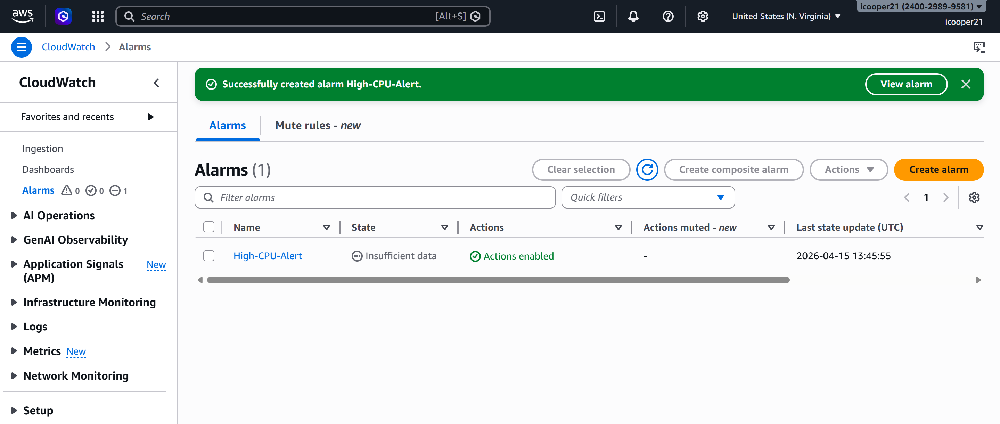
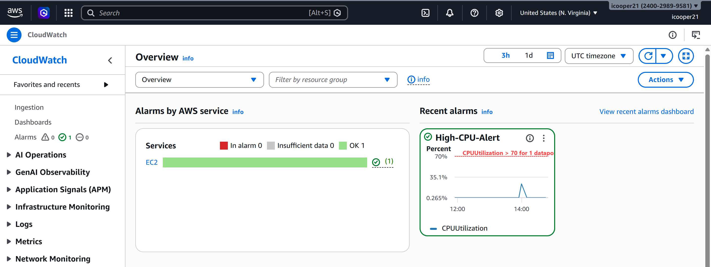

# aws-cloudwatch-security
Hands-on AWS lab demonstrating real-time monitoring and alerting using CloudWatch by simulating abnormal activity and validating detection and response.

# 🚨 AWS CloudWatch Security Monitoring & Alerting Lab

## 📌 Project Overview
This project demonstrates real-time security monitoring in AWS by configuring CloudWatch alarms, triggering a simulated resource spike, and validating alert notifications and system recovery.

## 🎯 Objectives
- Configure CloudWatch alarm for resource monitoring
- Simulate abnormal system behavior (CPU spike)
- Trigger automated alert notification
- Validate detection and response workflow
- Restore system to normal state

## 🛠️ Technologies Used
- Amazon CloudWatch (monitoring and alerting)
- Amazon EC2 (compute resource for simulation)

## 🚀 1. Alarm Configuration
- Created CloudWatch alarm monitoring EC2 CPUUtilization
- Set threshold to trigger when CPU usage exceeds 70%
- Configured SNS email notification for alerts

## 🔥 2. Alert Trigger (Detection)
- Connected to EC2 instance
- Simulated CPU spike using stress command
- CloudWatch detected abnormal activity and triggered alarm

## 🔧 3. Response & Recovery
- Terminated CPU stress process on EC2 instance
- System performance returned to normal levels
- CloudWatch alarm status returned to OK

## ⚠️ Security Analysis
### Risk Identified
- Lack of monitoring can delay detection of abnormal system behavior

### Impact
- Performance degradation
- Potential resource abuse or compromise going unnoticed

## 📚 Key Learnings
- CloudWatch enables real-time monitoring and alerting
- Alerts provide immediate visibility into abnormal activity
- Rapid response is critical to maintaining system stability

## 🧠 Conclusion
This lab demonstrates how cloud monitoring and alerting systems can detect, notify, and help resolve abnormal activity, reinforcing the importance of proactive security monitoring in AWS environments.

